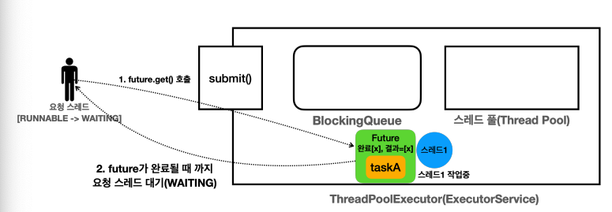

## 12. 스레드 풀과 Executor 프레임워크1

## 스레드를 직접 사용할 때의 문제점
### 스레드 생성 비용으로 인한 성능 문제
- 메모리 할당
  - 각 스레드는 자신만의 호출 스택을 가지고 있어야 한다.
  - 이 호출 스택은 스레드가 실행되는 동안 사용하는 메모리 공간이다.
  - 따라서 스레드를 생성할 때는 이 호출 스택을 위한 메모리를 할당해야 한다.
- 운영체제 자원 사용
  - 스레드를 생성하는 작업은 운영체제 커널 수준에서 이루어지며, 시스템 콜을 통해 처리된다.
  - 이는 CPU와 메모리 리소스를 소모하는 작업이다.
- 운영체제 스케줄러 설정
  - 새로운 스레드가 생성되면 운영체제의 스케줄러는 이 스레드를 관리하고 실행 순서를 조정해야 한다.
  - 이는 운영체제의 스케줄링 알고리즘에 따라 추가적인 오버헤드가 발생할 수 있다.
- 참고로 스레드 하나는 보통 1MB 이상의 메모리를 사용한다.
  - 스레드를 생성하는 작업은 상대적으로 무겁다.
  - 단순히 자바 객체를 하나 생성하는 것과는 비교할 수 없을 정도로 큰 작업이다.
- 이런 문제를 해결하려면 `생성한 스레드를 재사용하는 방법을 고려`할 수 있다.
  - 스레드를 재사용하면 처음 생성할 때를 제외하고는 생성을 위한 시간이 들지 않는다.
  - 따라서 스레드가 아주 빠르게 작업을 수행할 수 있다.

### 스레드 관리 문제
- 서버의 CPU, 메모리 자원은 한정되어 있기 때문에, 스레드는 무한하게 만들 수 없다.
- 우리 시스템이 버틸 수 있는, 최대 스레드의 수 까지만 스레드를 생성할 수 있게 관리해야 한다.
- 그리고 스레드가 어딘가에 관리가 되어 있어야 한다.

### Runnalbe 인터페이스의 불편함
- 반환 값이 없다.
  - `run()` 메서드는 반환 값을 가지지 않는다.
  - 따라서 실행 결과를 얻기 위해서는 별도의 메커니즘을 사용해야 한다.
  - 쉽게 이야기해서 스레드의 실행 결과를 직접 받을 수 없다.
- 예외 처리
  - `run()` 메서드는 체크 예외를 던질 수 없다.
  - 체크 예외의 처리는 메서드 내부에서 처리해야 한다.

## Executor 프레임워크 소개
- 멀티스레딩 및 병렬 처리를 쉽게 사용할 수 있도록 돕는 기능의 모음이다.
- 이 프레임워크는 작업 실행의 관리 및 스레드 풀 관리를 효율적으로 처리해서 개발자가 직접 스레드를 생성하고 관리하는 복잡함을 줄여준다.

## Callable
- 반환 타입이 제네릭이기 때문에 값을 반환할 수 있다.
- `throw Exception` 예외가 선언되어 있어, 해당 인터페이스를 구현하는 모든 메서드는 체크 예외인 `Exception` 과 그 하위 예외를 모두 던질 수 있다.
- `Runnable`과 비교하여 더 우위에 있다.

### Callable 과 Future 사용
- `Callable`은 작업의 처리 결과를 직접 반환되는 것이 아니라 `Future`라는 특별한 인터페이스를 통해 반환된다.
- `future.get()`을 호출하면 반환한 결과를 받을 수 있다.

### Executor 프레임워크의 강점
- 요청 스레드가 결과를 받아야 하는 상황이라면, `Callable`을 사용한 방식은 `Runnable`을 사용하는 방식보다 훨씬 편하다.
  - 코드만 보면 복잡한 멀티스레드를 사용한다는 느낌보다는, 단순한 싱글 스레드 방식으로 개발한다는 느낌이 된다.
- 단순하게 `ExecutorService`에 필요한 작업을 요청하고 결과를 받아서 쓰면 된다.
  - 복잡한 멀티스레드를 매우 편리하게 사용할 수 있는 것이 바로 `Executor` 프레임워크의 큰 강점이다.

## Future

- 전달한 작업의 미래 결과를 담고 있다고 생각하면 된다.
- `future.get()`을 호출했을 때
  - `Future가 완료 상태`
    - 완료 상태면 결과도 포함되어 있따.
    - 이 경우 요청 스레드는 대기하지 않고, 값을 즉시 반환받을 수 있다.
  - `Futrue가 완료 상태가 아님`
    - 아직 수행되지 않았거나 또는 수행 중이라는 뜻이다.
    - 이때는 어쩔 수 없이 요청 스레드가 결과를 받기 위해 대기해야 한다.
    - 요청 스레드가 마치 락을 얻을 때처럼, 결과를 얻기 위해 대기한다.
    - 이처럼 스레드가 어떤 결과를 얻기 위해 대기하는 것을 블로킹이라 한다.

### Future 정리
- `Future` 라는 개념이 없다면 결과를 받을 때까지 요청 스레드는 아무일도 못하고 대기해야 한다.
  - 따라서 다른 작업을 동시에 수행할 수도 없다.
- `Future` 라는 개념 덕분에 요청 스레드는 대기하지 않고, 다른 작업을 수행할 수 있다.
  - 예를 들어 다른 작업을 더 요청할 수 있다.
  - 그리고 모든 작업 요청이 끝난 다음에, 본인이 필요할 때 `Future.get()`을 호출해서 최종 결과를 받을 수 있다.
- `Future`를 사용하는 경우 결과적으로 `task1`, `task2`를 동시에 요청할 수 있다.
  - 두 작업을 바로 요청했기 때문에 작업을 동시에 제대로 수행할 수 있다.
- `Future` 는 요청 스레드를 블로킹(대기) 상태로 만들지 않고, 필요한 요청을 모두 수행할 수 있게 해준다.
  - 필요한 모든 요청을 한 다음에 `Future.get()` 을 통해 블로킹 상태로 대기하며 결과를 받으면 된다.
  - 이런 이유로 `ExecutorService` 는 결과를 직접 반환하지 않고, `Future` 를 반환한다

## 정리
### `ExecutorService`
- `Executor` 인터페이스를 확장하여 작업 제출과 제어 기능을 추가로 제공한다.
- 주요 메서드로는 `submit()` , `invokeAll()` , `invokeAny()` , `shutdown()` 등이 있다.
- `Executor` 프레임워크를 사용할 때는 대부분 이 인터페이스를 사용한다.
- `ExecutorService` 인터페이스의 기본 구현체는 `ThreadPoolExecutor` 이다.

### 작업 컬렉션 처리
- `invokeAll()`
  - 모든 `Callable` 작업을 제출하고, 모든 작업이 완료될 때까지 기다린다.
- `invokeAny()`
  - 하나의 `Callable` 작업이 완료될 때까지 기다리고, 가장 먼저 완료된 작업의 결과를 반환한다.