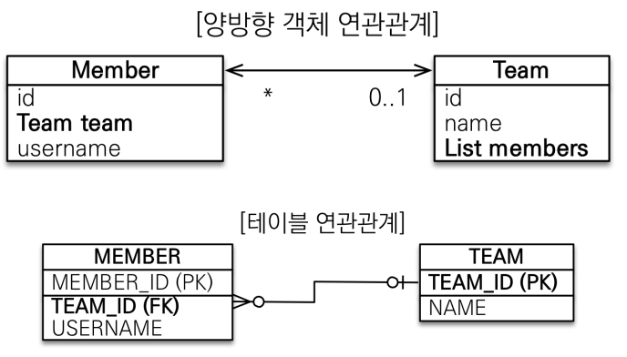

## 05. 연관관계 매핑 기초

### 연관관계가 필요한 이유
- 객체를 테이블에 맞추어 데이터 중심으로 모델링하면, 협력 관계를 만들 수 없다.
- **테이블은 외래 키로 조인**을 사용해서 연관된 테이블을 찾는다.
- **객체는 참조**를 사용해서 연관된 객체를 찾는다.
- 테이블과 객체 사이에는 이런 큰 간격이 있다.

### 단방향 연관관계
- 객체의 참조와 테이블의 외래 키를 매핑

### 양방향 연관관계와 연관관계의 주인
#### 양방향 매핑

#### 객체의 양방향 관계
- 객체의 **양방향 관계는 사실 양방향 관계가 아니라 서로 다른 단방향 관계 2개다.**
- 객체를 양방향으로 참조하려면 **단방향 연관관계를 2개** 만들어야 한다.

#### 테이블의 양방향 연관관계
- 테이블은 **외래 키 하나**로 두 테이블의 연관관계를 관리

#### 연관관계의 주인(Owner)
- **양방향 매핑 규칙**
  - 객체의 두 관계중 하나를 연관관계의 주인으로 지정
  - **연관관계의 주인만이 외래 키를 관리(등록, 수정)**
  - **주인이 아닌 쪽은 읽기만 가능**
  - 주인은 **mappedBy** 속성 사용 ❌
  - 주인이 아니면 **mappedBy** 속성으로 주인 지정

#### 누구를 주인으로?
- ✅ **외래 키가 있는 곳을 주인으로 정해라**