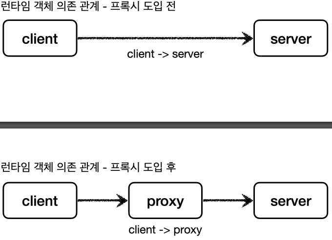

## 4. 프록시 패턴과 데코레이터 패턴

### 클라이언트와 서버
 
- **클라이언트는 서버에 필요한 것을 요청하고, 서버는 클라이언트의 요청을 처리**하는 것이다.

### 직접 호출과 간접 호출
- **직접 호출**
  - 클라이언트와 서버 개념에서 일반적으로 클라이언트가 서버를 직접 호출하고, 처리 결과를 직접 받는다.
- **간접 호출**
  - 클라이언트가 요청한 결과를 서버에 직접 요청하는 것이 아니라, 대리자를 통해서 대신 간접적으로 서버에 요청한다.
  - 여기서 **대리자를 영어로 프록시(proxy)** 라고 한다.

### 프록시
- **대체 가능**
  - 객체에서 **프록시**가 되려면, **클라이언트**는 **서버**에게 요청을 한 것인지, **프록시**에게 요청을 한 것인지 조차 몰라야 한다.
  - 쉽게 이야기해서 **서버**와 **프록시**는 같은 **인터페이스**를 사용해야 한다.
  - 그리고 **클라이언트**가 사용하는 **서버 객체**를 **프록시 객체**로 변경해도 **클라이언트 코드**를 변경하지 않고 동작할 수 있어야 한다.
  ** 에만 의존한다.
    - 그리고 **서버**와 **프록시**가 같은 **인터페이스**를 사용한다. 따라서 **DI**를 사용해서 대체 가능하다.

- **런타임 객체 의존 관계**

  - **런타임(애플리케이션 실행 시점)** 에서 **클라이언트 객체**에 **DI**를 사용해서 `Client -> Server` 에서 `Client -> Proxy`로
  객체 의존관계를 변경해도 **클라이언트 코드**를 전혀 변경하지 않아도 된다. (클라이언트 입장에서는 변경 사실 조차 모른다.)
  - **DI**를 사용하면 **클라이언트 코드**의 변경 없이 유연하게 **프록시**를 주입할 수 있다.

- **주요 기능**
  - 접근 제어
    - 권한에 따른 접근 차단
    - 캐싱
    - 지연 로딩
  - 부가 기능 추가
    - 원래 서버가 제공하는 기능에 더해서 부가 기능을 수행한다.
    - 예) 요청 값이나, 응답 값을 중간에 변형한다.
    - 예) 실행 시간을 측정해서 추가 로그를 남긴다.

### GOF 디자인 패턴
- 둘 다 **프록시**를 사용하는 방법이지만 **GOF 디자인 패턴**에서는 이 둘을 의도(intent)에 따라서 **프록시 패턴**과 **데코레이터 패턴**으로 구분한다.
- **프록시 패턴**
  - 접근 제어가 목적
- **데코레이터 패턴**
  - 새로운 기능 추가가 목적