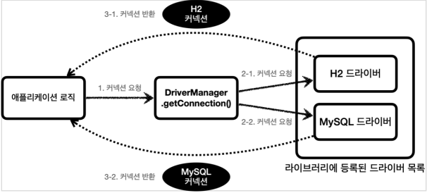
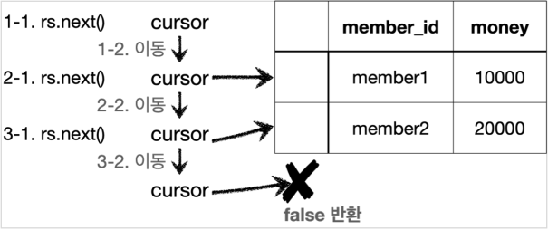

### 1. JDBC 이해
* JDBC 등장 이유
    * 각각의 데이터베이스 마다 커넥션을 연결하는 방법, SQL을 전달하는 방법,
      결과를 응답 받는 방법이 모두 다르기에 `JDBC` 라는 자바 표준이 등장

* JDBC 표준 인터페이스
    * `JDBC(Java Database Connectivity)`는 자바에서 데이터베이스에 접속할 수 있도록 하는 `자바 API`다.
    * `JDBC`는 데이터베이스에서 자료를 쿼리하거나 업데이트하는 방법을 제공한다. - 위키백과

* JDBC와 최신 데이터 접근 기술
    * JDBC 직접 사용
        * 애플리케이션 로직 단에서 직접 `JDBC`를 사용하는 방식
    * SQL Mapper
        * 애플리케이션 로직과 JDBC 사이에 `SQL Mapper`를 이용하는 방식
        * 장점
            * `JDBC`를 편리하게 사용하도록 도와준다.
            * SQL 응답 결과를 객체로 편리하게 변환해준다.
            * `JDBC`의 반복 코드를 제거해준다
        * 단점
            * 개발자가 SQL을 직접 작성해야한다.
        * 대표기술
            * 스프링 JdbcTemplate, MyBatis
    * ORM 기술
        * 객체를 관계형 데이터베이스 테이블과 매핑해주는 기술
        * 개발자 대신에 SQL을 동적으로 만들어 실행해준다.
        * 대표 기술
            * JPA (자바 진영의 ORM 표준 인터페이스), 하이버네이트, 이클립스링크

* 데이터베이스 연결
  * DriverManager 커넥션 요청 흐름
  
    * 애플리케이션 로직에서 커넥션이 필요하면 `DriverManager.getConnection()` 을 호출한다.
    * `DriverManager` 는 라이브러리에 등록된 드라이버 목록을 자동으로 인식한다. 이 드라이버들에게 순서대
      로 다음 정보를 넘겨서 커넥션을 획득할 수 있는지 확인한다.
    * 이렇게 찾은 커넥션 구현체가 클라이언트에 반환된다.

* ResultSet
  * ResultSet 결과 예시
    