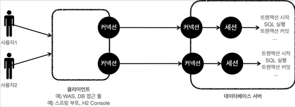

### 3. 트랜잭션 이해
* 트랜잭션 ACID
  * 원자성
    * 트랜잭션 내에서 실행한 작업들은 마치 하나의 작업인 것처럼 모두 성공 하거나 모두 실패해야 한다.
  * 일관성
    * 모든 트랜잭션은 일관성 있는 데이터베이스 상태를 유지해야 한다. 
    * 예를 들어 데이터베이스에서 정한 무결성 제약 조건을 항상 만족해야 한다.
  * 격리성
    * 동시에 실행되는 트랜잭션들이 서로에게 영향을 미치지 않도록 격리한다. 
    * 예를 들어 동시에 같은 데이터를 수정하지 못하도록 해야 한다. 
    * 격리성은 동시성과 관련된 성능 이슈로 인해 트랜잭션 격리 수준(Isolation level)을 선택할 수 있다.
  * 지속성
    * 트랜잭션을 성공적으로 끝내면 그 결과가 항상 기록되어야 한다. 
    * 중간에 시스템에 문제가 발생해도 데이터베이스 로그 등을 사용해서 성공한 트랜잭션 내용을 복구해야 한다.

* 트랜잭션 격리 수준 - Isolation level
  * 등장배경
    * 트랜잭션은 원자성, 일관성, 지속성을 보장한다. 
    * 문제는 격리성인데 트랜잭션 간에 격리성을 완벽히 보장하려면 트랜잭션을 거의 순서대로 실행해야 한다. 
    * 이렇게 하면 동시 처리 성능이 매우 나빠진다. 이런 문제로 인해 ANSI 표준은 트랜잭션의 격리 수준을 4단계로 나누어 정의했다.
  * READ UNCOMMITED(커밋되지 않은 읽기)
  * READ COMMITTED(커밋된 읽기) - 주로 사용
  * REPEATABLE READ(반복 가능한 읽기) 
  * SERIALIZABLE(직렬화 가능) 

* 데이터베이스 연결 구조와 DB 세션
  * 데이터베이스 연결 구조 1
  
    * 사용자는 웹 애플리케이션 서버(WAS)나 DB 접근 툴 같은 클라이언트를 사용해서 데이터베이스 서버에 접근할 수 있다. 
    * 클라이언트는 데이터베이스 서버에 연결을 요청하고 커넥션을 맺게 된다. 
    * 이때 데이터베이스 서버는 내부에 세션이라는 것을 만든다. 
    * 쉽게 이야기해서 개발자가 클라이언트를 통해 SQL을 전달하면 현재 커넥션에 연결된 세션이 SQL을 실행 한다.
    * 세션은 트랜잭션을 시작하고, 커밋 또는 롤백을 통해 트랜잭션을 종료한다. 그리고 이후에 새로운 트랜잭션을 다시 시작할 수 있다. 
    * 사용자가 커넥션을 닫거나, 또는 DBA(DB 관리자)가 세션을 강제로 종료하면 세션은 종료된다.
  
  * 데이터베이스 연결 구조2
  
    * 커넥션 풀이 10개의 커넥션을 생성하면, 세션도 10개 만들어진다

* 정리
  * 원자성
    * 트랜잭션 내에서 실행한 작업들은 마치 하나의 작업인 것처럼 모두 성공하거나 모두 실패해야 한다.
    * 트랜잭션의 원자성 덕분에 여러 SQL 명령어를 마치 하나의 작업인 것처럼 처리할 수 있다.
    * 성공하면 한번에 반영, 중간에 실패시 하나의 작업을 되돌리는 것처럼 간단히 되돌릴 수 있다.
  * 오토 커밋
    * 계좌이체 등 중간에 실패할 수 있는 동작은 오토커밋을 꺼야한다.
  * 트랜잭션 시작
    * 오토커밋을 꺼야 하는 작업들은 꼭 수동 커밋 모드를 사용해서 수동으로 커밋, 롤백 할 수 있도록 해야 한다.
    * 보통 자동 커밋 모드 -> 수동 커밋 모드로 전환하는 것을 트랜잭션을 시작한다고 표현한다.