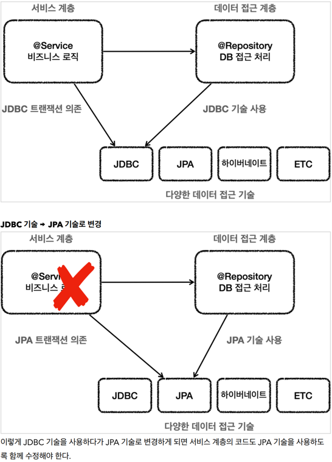
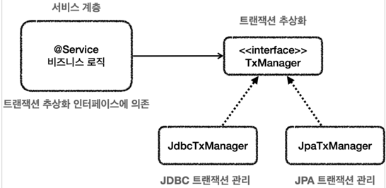
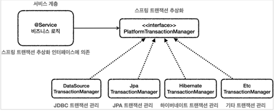

### 4. 스프링 문제와 해결 - 트랜잭션
* JDBC 트랜잭션 의존
  
  * 서비스 계층의 트랜잭션을 처리하는 코드가 `JDBC`에 의존하다가 `JPA` 기술로 변경 시에 서비스 계층의
  코드도 수정을 해줘야 한다.
  

* 트랜잭션 추상화와 의존관계
  
  * 클라이언트인 서비스는 인터페이스에 의존하고 `DI`를 사용한 덕분에 `OCP 원칙`을 지키게 되었다. 
  * 이제 트랜 잭션을 사용하는 서비스 코드를 전혀 변경하지 않고, 트랜잭션 기술을 마음껏 변경할 수 있다.

* 스프링의 트랜잭션 추상화
  
  * 스프링은 이미 이런 고민을 다 해두었다. 
  * 우리는 스프링이 제공하는 트랜잭션 추상화 기술을 사용하면 된다. 
  * 심지어 데이터 접근 기술에 따른 트랜잭션 구현체도 대부분 만들어두어서 가져다 사용하기만 하면 된다.

* @Transactional
  * 스프링이 제공하는 트랜잭션 AOP
  * 트랜잭션 프록시를 사용하면, 트랜잭션 프록시가 트랜잭션 처리 로직을 모두 가져간다. 
  * 그리고 트랜잭션을 시작한 후에 실제 서비스를 대신 호출한다. 트랜잭션 프록시 덕분에 서비스 계층에는 순수한 비즈니즈 로직만 남길 수 있다.