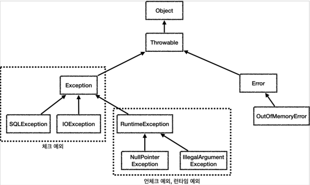

### 5. 자바 예외 이해
* #### 예외 계층
  
  * `Object` 
    * 예외도 객체이다. 
    * 모든 객체의 최상위 부모는 `Object`이므로 예외의 최상위 부모도 `Object`이다.
  * `Throwable`
    * 최상위 예외이다. 
    * 하위에 `Exception`과 `Error`가 있다.
  * `Error`
    * 메모리 부족이나 심각한 시스템 오류와 같이 애플리케이션에서 복구 불가능한 시스템 예외이다. 
    * 애플리케이션 개발자는 이 예외를 잡으려고 해서는 안된다. 
      * 상위 예외를 `catch`로 잡으면 그 하위 예외까지 함께 잡는다. 
      * 따라서 애플리케이션 로직에서는 `Throwable`예외도 잡으면 안되는데, 앞서 이야기한 `Error`예외도 함께 잡을 수 있기 때문이다. 
      * 애 플리케이션 로직은 이런 이유로 `Exception`부터 필요한 예외로 생각하고 잡으면 된다. 
      * 참고로 `Error`도 언체크 예외이다. 
  * `Exception`
    * 체크 예외 
    * 애플리케이션 로직에서 사용할 수 있는 실질적인 최상위 예외이다. 
    * `Exception`과 그 하위 예외는 모두 컴파일러가 체크하는 체크 예외이다. 단 `RuntimeException`은
      예외로 한다.
  * `RuntimeException`
    * 언체크 예외, 런타임 예외 
    * 컴파일러가 체크 하지 않는 언체크 예외이다. 
    * `RuntimeException`과 그 자식 예외는 모두 언체크 예외이다. 
    * `RuntimeException`의 이름을 따라서 `RuntimeException`과 그 하위 언체크 예외를 런타임 예외라
        고 많이 부른다.

* #### 예외 기본 규칙
  * 예외는 잡아서 처리하거나 던져야 한다.
  * 예외를 잡거나 던질 때 지정한 예외뿐만 아니라 그 예외의 자식들도 함께 처리된다.
    * 예를 들어서 `Exception`을 `catch`로 잡으면 그 하위 예외들도 모두 잡을 수 있다
    * 예를 들어서 `Exception`을 `throws`로 던지면 그 하위 예외들도 모두 던질 수 있다

* #### 체크 예외의 장단점
  * 장점
    * 개발자가 실수로 예외를 누락하지 않도록 컴파일러를 통해 문제를 잡아주는 훌륭한 안전 장치이다.
  * 단점
    * 실제로는 개발자가 모든 체크 예외를 반드시 잡거나 던지도록 처리해야 하기 때문에, 너무 번거로운 일이 된다.
    * 크게 신경쓰고 싶지 않은 예외까지 모두 챙겨야 한다.
    * 의존관계에 따른 단점도 있다.

* #### 언체크 예외의 장단점
  * 장점
    * 신경쓰고 싶지 않은 언체크 예외를 무시할 수 있다.
    * 체크 예외의 경우 처리할 수 없는 예외를 밖으로 던지려면 항상 `throws 예외`를 선언해야 하지만, 언체크 예외는 생략이 가능.
    * 신경쓰고 싶지 않은 예외의 의존관계를 참조하지 않아도 된다.
  * 단점
    * 언체크 예외는 개발자가 실수로 예외를 누락할 수 있다. 반면에 체크 예외는 컴파일러를 통해 예외 누락을 잡아준다.

* #### 체크 예외 활용
  * 기본적으로 언체크(런타임) 예외를 사용한다.
  * 체크 예외는 비즈니스 로직상 의도적으로 던지는 예외에만 사용한다.
    * 체크 예외 예) 계좌 이체 실패 예외, 결제시 포인트 부족 예외, 로그인 ID와 PW 불일치 예외
    * 물론 이 경우에도 100% 체크 예외로 만들어야 하는 것은 아니며, 계좌 이체 실패처럼 매우 심각한 문제는 개발자가
    실수로 예외를 놓치면 안된다고 판단할 수 있다. 이때 체크 예외로 만들어 두면 컴파일러를 통해 놓친 예외를 인지할 수 있다.

* #### 체크 예외의 문제점
  * 복구 불가능한 예외
    * 대부분의 예외는 복구가 불가능하다. 일부 복구가 가능한 예외도 있지만 아주 적다.
    * 특히나 대부분의 서비스나 컨트롤러는 데이터베이스의 문제를 해결할 수 없다.
    * 따랏 이런 문제들은 일관성 있게 공통으로 처리해야 한다. (오류로그를 남기고, 개발자가 빠르게 인지)
    * 예) 서블릿 필터, 스프링 인터셉터, 스프링의 `ControllerAdvice`
  * 의존 관계에 대한 문제
    * 컨트롤러나 서비스 입장에서는 본인이 처리할 수 없어도 어쩔 수 없이 `throws`를 통해 던지는 예외를 선언해야 한다.
    * 예를 들어 서비스, 컨트롤러에서 `java.sql.SQLException` 등에 의존하게 되면, 리포지토리를 `JDBC` 기술에서 `JPA` 기술로 변경 시에
      (`SQLException` -> `JPAException`) 해당 리포지토리에 의존하던 모든 서비스, 컨트롤러의 코드를 수정해야 한다.
    * 서비스나 컨트롤러 입장에서는 어차피 본인이 처리할 수도 없는 예외를 의존해야 하는 큰 단점이 발생한다.
    * 결과적으로 `OCP`, `DI`를 통해 클라이언트 코드의 변경 없이 대상 구현체를 변경할 수 있다는 장점이 체크 예외 때문에 발목을 잡게 된다.
  * 정리
    * 처리할 수 있는 체크 예외라면 서비스나 컨트롤러에서 처리하겠지만, 지금처럼 데이터베이스나 네트워크 통신처럼 시스템 레벨에서 올라온 예외들은 대부분 복구가 불가능하다. 
    * 그리고 실무에서 발생하는 대부분의 예외들은 이런 시스템 예외들이다. 
    * 문제는 이런 경우에 체크 예외를 사용하면 아래에서 올라온 복구 불가능한 예외를 서비스, 컨트롤러 같은 각각의 클래스가 모두 알고 있어야 한다. 
    * 그래서 불필요한 의존관계 문제가 발생하게 된다.

* #### 언체크(런타임) 예외 활용
  * 예외 전환
    * 체크 예외를 런타임 예외로 전환해서 예외를 던진다.
      * 참고로 이때 기존 예외를 포함해주어야 예외 출력시 스택 트레이스에서 기존 예외도 함께 확인 할 수 있다.
  * 런타임 예외 - 대부분 복구 불가능한 예외
    * 시스템에서 발생한 예외는 대부분 복구 불가능 예외이다.
    * 런타임 예외를 사용하면 서비스나 컨트롤러가 이런 복구 불가능한 예외를 신경쓰지 않아도 된다.
    * 이렇게 복구 불가능한 예외는 일관성 있게 공통으로 처리해야 한다.
  * 런타임 예외 - 의존 관계에 대한 문제
    * 런타임 예외는 해당 객체가 처리할 수 없는 예외는 무시하면 된다.
    * 체크 예외 처럼 예외를 강제로 의존하지 않아도 된다.
  * 대신 런타임 예외는 문서화를 잘해야 한다.