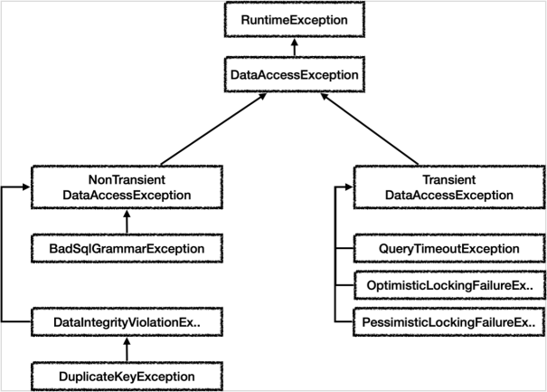

### 6. 스프링과 문제 해결 - 예외 처리, 반복
* #### 런타임 예외 적용
  * 예외 변환시 주의점
    * 체크 예외를 런타임 예외로 변환할 때에는 기존 예외를 `꼭!` 포함해야 한다.
    * 장애가 발생하고 로그에서 진짜 원인이 남지 않는 심각한 문제가 발생할 수 있다.


* #### 스프링 예외 추상화 이해
  * 스프링은 데이터 접근과 관련된 예외를 추상화해서 제공한다.
  * 스프링 데이터 접근 예외 계층
    
    * 그림은 일부 생략되어 있다. 
    * 스프링은 데이터 접근 계층에 대한 수십 가지 예외를 정리해서 일관된 예외 계층을 제공한다.
    * 각각의 예외는 특정 기술에 종속적이지 않게 설계되어 있다. 즉 서비스 계층에서도 사용이 가능하다.
    * `JDBC`나 `JPA를 사용할 때 발생하는 예외를 스프링이 제공하는 예외로 변환해주는 역할도 스프링이 제공한다.
    * 예외의 최고 상위 `DataAccessException`
      * `Transient`
        * 일시적으로 동일한 `SQL`을 다시 시도했을 때 성공할 가능성이 있다.
        * 예) 쿼리 타임아웃, 락과 관련된 오류들
      * `NonTransient`
        * 동일한 `SQL`을 그대로 반복해서 실행하면 실패한다.
        * `SQL` 문법 오류, 데이터베이스 제약조건 위배 `
  * 스프링이 제공하는 `SQL` 예외 변환기
    * 스프링은 예외 변환기를 통해서 `SQLException`의 `ErrorCode`에 맞는 적절한 스프링 데이터 접근 예외로 변환해준다.
      ```java
      SQLExceptionTranslator exTranslator = new SQLErrorCodeSQLExceptionTranslator(dataSource);
      DataAccessException resultEx = exTranslator.translate("select", sql, e);
      ```
    * 스프링 예외 추상화 덕분에 특정 기술에 종속적이지 않게 되었다. (`JDBC` -> `JPA` 변경시 코드 변경 최소화)


* #### JDBC 반복 문제 해결 - JdbcTemplate
  * JDBC 반복 문제
    * JDBC 반복 문제 
    * 커넥션 조회, 커넥션 동기화 
    * PreparedStatement 생성 및 파라미터 바인딩 
    * 쿼리 실행 
    * 결과 바인딩 
    * 예외 발생시 스프링 예외 변환기 실행 
    * 리소스 종료
  * `JdbcTemplate` 은 `JDBC`로 개발할 때 발생하는 위의 반복들을 대부분 해결해준다. 
  * 트랜잭션을 위한 커넥션 동기화는 물론이고, 예외 발생시 스프링 예외 변환기도 자동으로 실행해준다.