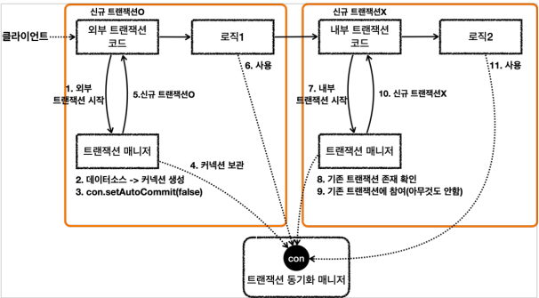
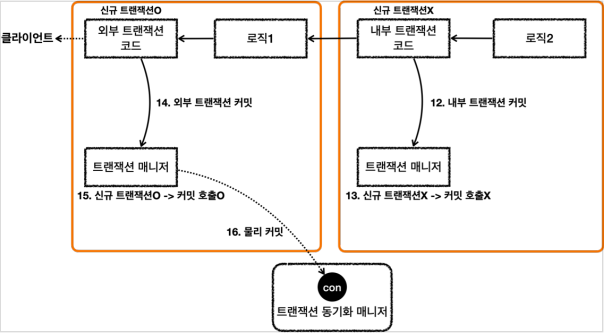
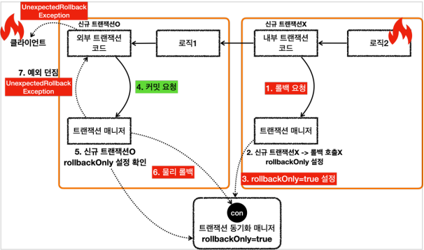
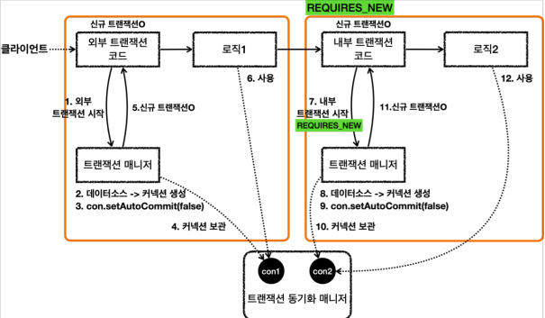
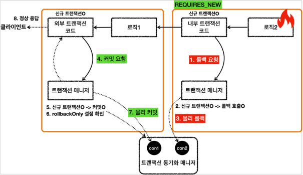

## 10. 스프링 트랜잭션 전파1 - 기본

* ### 스프링 트랜잭션 전파 기본
  
  
  * 스프링은 외부 트랜잭션이 수행중인데, 내부 트랜잭션이 추가로 수행되면 `하나의 물리 트랜잭션으로 묶어준다.`
  * 이때 스프링은 이해를 돕기 위해 `논리 트랜잭션` 과 `물리 트랜잭션` 이라는 개념으로 나눈다.
  * `논리 트랜잭션` 은 하나의 `물리 트랜잭션`으로 묶인다.
  * `물리 트랜잭션` 은 우리가 이해하는 실제 데이터베이스에 적용되는 트랜잭션을 뜻한다.
    * 실제 커넥션을 통해서 트랜잭션을 시작하고, 실제 커넥션을 통해서 커밋, 롤백하는 단위이다.
  * `논리 트랜잭션` 은 트랜잭션 매니저를 통해 트랜잭션을 사용하는 단위이다.
  * #### 원칙
    * #### 모든 논리 트랜잭션이 커밋되어야 물리 트랜잭션이 커밋된다.
    * #### 하나의 논리 트랜잭션이라도 롤백되면 물리 트랜잭션은 롤백된다.

* ### 스프링 트랜잭션 전파 기본 흐름
  * 스프링은 `여러 트랜잭션` 이 함께 사용되는 경우, `중복 커밋 문제`를 해결하기 위해 `처음 트랜잭션을 시작한 외부 트랜잭션이 실제 물리 트랜잭션을 관리`
  하도록 한다.

     
    * 요청 흐름
    
    
    * 응답 흐름
  * 핵심 정리
    * 핵심은 `트랜잭션 매니저`에 커밋을 호출한다고 해서 항상 실제 커넥션에 `물리 커밋`이 발생하지 않는다는 점이다.
    * `신규 트랜잭션`인 경우에만 실제 커넥션을 사용해서 `물리 커밋`과 `롤백`을 수행한다.
    * `트랜잭션`이 내부에서 추가로 사용되면, `트랜잭션 매니저`를 통해 `논리 트랜잭션`을 관리하고, 모든 `논리 트랜잭션`이 커밋되면 `물리 트랜잭션`이
    커밋된다고 이해하면 된다.

* ### 스프링 트랜잭션 전파 내부 롤백
  * `내부 트랜잭션`이 롤백이 되었을 경우, `외부(물리) 트랜잭션` 전체가 롤백된다.
    
    * 응답 흐름
  * 핵심 정리
    * `논리 트랜잭션`이 하나라도 롤백되면 `물리 트랜잭션`은 롤백된다.
    * `내부 논리 트랜잭션`이 롤백되면 롤백 전용 마크를 `트랜잭션 동기화 매니저`에 표시한다.
    * `외부 트랜잭션`을 커밋할 때 롤백 전용마크를 확인 후, 롤백 전용 마크가 표시되어 있으면 `물리 트랜잭션`을 롤백하고,
    `UnexpectedRollbackException` 예외를 던진다.

* ### 스프링 트랜잯션 전파 REQUIRES_NEW
  * `물리 트랜잭션`을 분리하려면 `내부 트랜잭션`을 시작할 때 `REQUIRES_NEW` 옵션을 사용하면 된다.
  * 요청 흐름
    
    * `내부 트랜잭션`을 시작할 때 `REQUIRES_NEW` 옵션을 주고 시작한다.
    * `트랜잭션 매니저`는 `트랜잭션 동기화 매니저`에 커넥션을 보관한다.
      * 이때 `외부 트랜잭션`에서 사용하던 커넥션을 잠시 보류하고, 새로운 커넥션을 사용한다.
    * `트랜잭션 매니저`는 신규 `트랜잭션`의 생성한 결과를 반환한다.
  * 응답 흐름
    
    * `내부 트랜잭션`에서 롤백을 요청하면, `트랜잭션 매니저`는 롤백 시점에 `신규 트랜잭션` 여부에 따라 다르게 동작한다.
      * 현재 `내부 트랜잭션`이 `신규 트랜잭션`이다.
    * `내부 트랜잭션`이 롤백을 하면, `외부 트랜잭션`에서 사용하던 커넥션의 보류가 끝나고, 다시 사용한다.
  * 정리
    * `REQUIRES_NEW` 옵션을 사용하면 `물리 트랜잭션`이 명확하게 분리된다. 
    * `REQUIRES_NEW` 를 사용하면 데이터베이스 커넥션이 동시에 2개 사용된다는 점을 주의해야 한다.