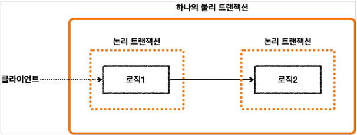

## 10. 스프링 트랜잭션 전파1 - 기본

* ### 스프링 트랜잭션 전파 기본
  
  * 스프링은 외부 트랜잭션이 수행중인데, 내부 트랜잭션이 추가로 수행되면 `하나의 물리 트랜잭션으로 묶어준다.`
  * 이때 스프링은 이해를 돕기 위해 `논리 트랜잭션` 과 `물리 트랜잭션` 이라는 개념으로 나눈다.
  * `논리 트랜잭션` 은 하나의 `물리 트랜잭션`으로 묶인다.
  * `물리 트랜잭션` 은 우리가 이해하는 실제 데이터베이스에 적용되는 트랜잭션을 뜻한다.
    * 실제 커넥션을 통해서 트랜잭션을 시작하고, 실제 커넥션을 통해서 커밋, 롤백하는 단위이다.
  * `논리 트랜잭션` 은 트랜잭션 매니저를 통해 트랜잭션을 사용하는 단위이다.
  * #### 원칙
    * #### 모든 논리 트랜잭션이 커밋되어야 물리 트랜잭션이 커밋된다.
    * #### 하나의 논리 트랜잭션이라도 롤백되면 물리 트랜잭션은 롤백된다.