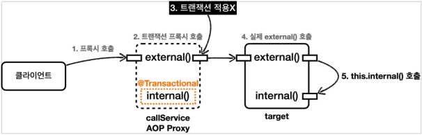
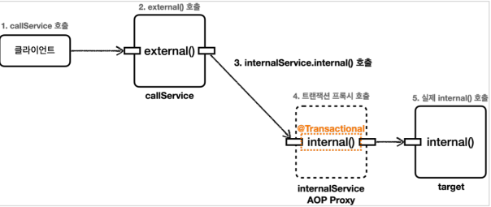

## 9. 스프링 트랜잭션 이해

* ### 트랜잭션 적용 확인
  * 스프링 컨테이너에 트랜잭션 프록시 등록
    
    * `@Transactional` 어노테이션이 특정 클래스나 메서드에 있으면, `트랜잭션 AOP` 는 해당 클래스를 프록시로 만들어서 스프링 컨테이너에 등록한다.
    * #### 실제 객체 대신에 프록시가 스프링 컨테이너에 등록되는 것이 핵심!
    * 클라이언트는 `스프링 컨테이너`에 의존관계 주입을 요청하면, `스프링 컨테이너`에는 실제 객체 대신에 프록시가 스프링 빈으로 등록되어 있기 때문에 프록시를 주입한다.

  * 트랜잭션 프록시 동작 방식
    
    * 트랜잭션 적용시
      * 클라이언트가 의존관계 주입 받은 메서드를 호출하면, 프록시는 `@Transactional` 가 붙어있는 지 확인한다. (붙어있어야 트랜잭션 적용 대상)
      * 프록시는 트랜잭션을 시작한 다음에 실제 메서드를 호출한다.
      * 실제 메서드의 호출이 끝나서 프록시로 리턴되면 프록시는 트랜잭션을 커밋하거나 롤백해서 트랜잭션을 종료한다.
    * 트랜잭션 미 적용시
      * 클라이언트가 의존관계 주입 받은 메서드를 호출하면, 프록시는 `@Transactional` 가 붙어있는 지 확인한다. (붙어있어야 트랜잭션 적용 대상)
      * 프록시는 트랜잭션을 시작 하지 않고, 실제 메서드만 호출하고 종료한다.

* ### 트랜잭션 적용 위치
  * 항상 더 구체적이고 자세한 것이 높은 우선순위를 가진다.
  * 스프링의 `Transactional` 의 규칙
    * 우선순위 규칙
      * 클래스 보다는 메서드가 더 구체적이므로 메서드에 있는 옵션을 사용한 트랜잭션이 적용된다.
    * 클래스에 적용하면 메서드는 자동 적용
      * 해당 메서드에 없어도 클래스에 선언이 되어 있다면, 자동으로 적용이 된다.

* ### 트랜잭션 AOP 주의 사항 - 프록시 내부 호출 
  * 배경
    * `AOP` 를 적용하면 스프링은 항상 대상 객체 대신에 프록시를 스프링 빈으로 등록한다.
    * 따라서 스프링은 의존 관계 주입시 항상 실제 객체대신에 프록시 객체를 주입한다.
    * 프록시 객체가 주입되기 때문에 대상 객체를 직접 호출하는 문제는 일반적으로 발생하지 않는다.
    * 하지만 `대상 객체의 내부에서 메서드 호출이 발생하면 프록시를 거치지 않고 대상 객체를 직접 호출하는 문제가 발생`한다.
  * 프록시와 내부 호출
    
    * 클라이언트인 테스트 코드는 `callService.external()` 을 호출한다. 여기서 `callService` 는 `트랜잭션 프록시` 이다.
    * `callService` 의 `트랜잭션 프록시` 가 호출된다.
    * `external()` 메서드에는 `@Transactional` 이 없다. 따라서 트랜잭션 프록시는 트랜잭션을 적용하지 않는다. 
    * 트랜잭션 적용하지 않고, 실제 `callService 객체 인스턴스의 external()` 을 호출한다. 
    * `external()` 은 내부에서 `internal()` 메서드를 호출한다. 그런데 여기서 `트랜잭션이 적용되지 않는 문제`가 발생한다.
  * 문제 원인
    * 자바 언어에서 메서드 앞에 별도의 참조가 없으면 `This` 라는 뜻으로 자기 자신의 인스턴스를 가리킨다.
    * 결과적으로 자기 자신의 내부 메서드를 호출하게 되는데, 이때 자기 자신을 가리키므로 `실제 대상 객체의 인스턴스` 를 뜻한다.
    * 이러한 내부 호출은 프록시를 거치지 않아서 `트랜잭션을 적용할 수 없다.`
    * 즉. `트랜잭션이 적용되는 프록시 객체` 가 아니라 `실제 객체의 메서드`를 호출하게 된 것이다.
  * 프록시 방식의 AOP 한계
    * `@Transactional` 를 사용하는 `트랜잭션 AOP`는 프록시를 사용한다.
    * 프록시를 사용하면 메서드 내부 호출에 프록시를 적용할 수 없다.

* ### 트랜잭션 AOP 주의 사항 - 프록시 내부 호출 해결방안
  * 트랜잭션을 필요로 하는 메서드를 새로운 클래스로 만든다.
  * 메서드 내부 호출에서 외부 호출로 변경한다.
  
  * 여러가지 다른 해결방안도 있지만, 실무에서는 이렇게 별도의 클래스로 분리하는 방법을 주로 사용한다.

* ### 트랜잭션은 private 메서드에서는 적용 X
  * 기존의 버전에서는 `public` 메서드 엣서만 적용하도록 기본 설정이 되어 있었다. 
  * 하지만 스프링 3.0 부터는 `protected` , `package-visible (default 접근제한자)` 에도 트랜잭션이 적용된다.