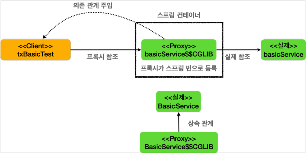
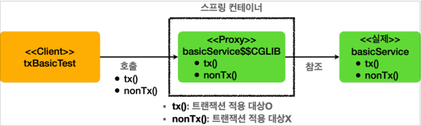

## 9. 스프링 트랜잭션 이해

* ### 트랜잭션 적용 확인
  * 스프링 컨테이너에 트랜잭션 프록시 등록
    
    * `@Transactional` 어노테이션이 특정 클래스나 메서드에 있으면, `트랜잭션 AOP` 는 해당 클래스를 프록시로 만들어서 스프링 컨테이너에 등록한다.
    * #### 실제 객체 대신에 프록시가 스프링 컨테이너에 등록되는 것이 핵심!
    * 클라이언트는 `스프링 컨테이너`에 의존관계 주입을 요청하면, `스프링 컨테이너`에는 실제 객체 대신에 프록시가 스프링 빈으로 등록되어 있기 때문에 프록시를 주입한다.

  * 트랜잭션 프록시 동작 방식
    
    * 트랜잭션 적용시
      * 클라이언트가 의존관계 주입 받은 메서드를 호출하면, 프록시는 `@Transactional` 가 붙어있는 지 확인한다. (붙어있어야 트랜잭션 적용 대상)
      * 프록시는 트랜잭션을 시작한 다음에 실제 메서드를 호출한다.
      * 실제 메서드의 호출이 끝나서 프록시로 리턴되면 프록시는 트랜잭션을 커밋하거나 롤백해서 트랜잭션을 종료한다.
    * 트랜잭션 미 적용시
      * 클라이언트가 의존관계 주입 받은 메서드를 호출하면, 프록시는 `@Transactional` 가 붙어있는 지 확인한다. (붙어있어야 트랜잭션 적용 대상)
      * 프록시는 트랜잭션을 시작 하지 않고, 실제 메서드만 호출하고 종료한다.

* ### 트랜잭션 적용 위치
  * 항상 더 구체적이고 자세한 것이 높은 우선순위를 가진다.
  * 스프링의 `Transactional` 의 규칙
    * 우선순위 규칙
      * 클래스 보다는 메서드가 더 구체적이므로 메서드에 있는 옵션을 사용한 트랜잭션이 적용된다.
    * 클래스에 적용하면 메서드는 자동 적용
      * 해당 메서드에 없어도 클래스에 선언이 되어 있다면, 자동으로 적용이 된다.