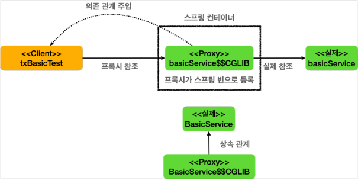
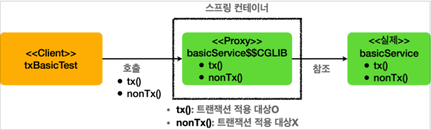
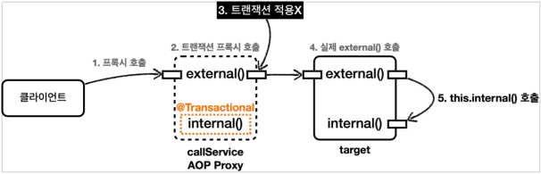
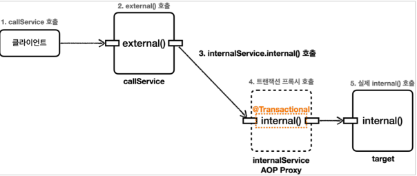

## 9. 스프링 트랜잭션 이해

* ### 트랜잭션 적용 확인
  * 스프링 컨테이너에 트랜잭션 프록시 등록

    

    * `@Transactional` 어노테이션이 특정 클래스나 메서드에 있으면, `트랜잭션 AOP` 는 해당 클래스를 프록시로 만들어서 스프링 컨테이너에 등록한다.
    * #### 실제 객체 대신에 프록시가 스프링 컨테이너에 등록되는 것이 핵심!
    * 클라이언트는 `스프링 컨테이너`에 의존관계 주입을 요청하면, `스프링 컨테이너`에는 실제 객체 대신에 프록시가 스프링 빈으로 등록되어 있기 때문에 프록시를 주입한다.

  * 트랜잭션 프록시 동작 방식

    
    * 트랜잭션 적용시
      * 클라이언트가 의존관계 주입 받은 메서드를 호출하면, 프록시는 `@Transactional` 가 붙어있는 지 확인한다. (붙어있어야 트랜잭션 적용 대상)
      * 프록시는 트랜잭션을 시작한 다음에 실제 메서드를 호출한다.
      * 실제 메서드의 호출이 끝나서 프록시로 리턴되면 프록시는 트랜잭션을 커밋하거나 롤백해서 트랜잭션을 종료한다.
    * 트랜잭션 미 적용시
      * 클라이언트가 의존관계 주입 받은 메서드를 호출하면, 프록시는 `@Transactional` 가 붙어있는 지 확인한다. (붙어있어야 트랜잭션 적용 대상)
      * 프록시는 트랜잭션을 시작 하지 않고, 실제 메서드만 호출하고 종료한다.

* ### 트랜잭션 적용 위치
  * 항상 더 구체적이고 자세한 것이 높은 우선순위를 가진다.
  * 스프링의 `Transactional` 의 규칙
    * 우선순위 규칙
      * 클래스 보다는 메서드가 더 구체적이므로 메서드에 있는 옵션을 사용한 트랜잭션이 적용된다.
    * 클래스에 적용하면 메서드는 자동 적용
      * 해당 메서드에 없어도 클래스에 선언이 되어 있다면, 자동으로 적용이 된다.

* ### 트랜잭션 AOP 주의 사항 - 프록시 내부 호출 
  * 배경
    * `AOP` 를 적용하면 스프링은 항상 대상 객체 대신에 프록시를 스프링 빈으로 등록한다.
    * 따라서 스프링은 의존 관계 주입시 항상 실제 객체대신에 프록시 객체를 주입한다.
    * 프록시 객체가 주입되기 때문에 대상 객체를 직접 호출하는 문제는 일반적으로 발생하지 않는다.
    * 하지만 `대상 객체의 내부에서 메서드 호출이 발생하면 프록시를 거치지 않고 대상 객체를 직접 호출하는 문제가 발생`한다.
  * 프록시와 내부 호출

    
    * 클라이언트인 테스트 코드는 `callService.external()` 을 호출한다. 여기서 `callService` 는 `트랜잭션 프록시` 이다.
    * `callService` 의 `트랜잭션 프록시` 가 호출된다.
    * `external()` 메서드에는 `@Transactional` 이 없다. 따라서 트랜잭션 프록시는 트랜잭션을 적용하지 않는다. 
    * 트랜잭션 적용하지 않고, 실제 `callService 객체 인스턴스의 external()` 을 호출한다. 
    * `external()` 은 내부에서 `internal()` 메서드를 호출한다. 그런데 여기서 `트랜잭션이 적용되지 않는 문제`가 발생한다.
  * 문제 원인
    * 자바 언어에서 메서드 앞에 별도의 참조가 없으면 `This` 라는 뜻으로 자기 자신의 인스턴스를 가리킨다.
    * 결과적으로 자기 자신의 내부 메서드를 호출하게 되는데, 이때 자기 자신을 가리키므로 `실제 대상 객체의 인스턴스` 를 뜻한다.
    * 이러한 내부 호출은 프록시를 거치지 않아서 `트랜잭션을 적용할 수 없다.`
    * 즉. `트랜잭션이 적용되는 프록시 객체` 가 아니라 `실제 객체의 메서드`를 호출하게 된 것이다.
  * 프록시 방식의 AOP 한계
    * `@Transactional` 를 사용하는 `트랜잭션 AOP`는 프록시를 사용한다.
    * 프록시를 사용하면 메서드 내부 호출에 프록시를 적용할 수 없다.

* ### 트랜잭션 AOP 주의 사항 - 프록시 내부 호출 해결방안
  * 트랜잭션을 필요로 하는 메서드를 새로운 클래스로 만든다.
  * 메서드 내부 호출에서 외부 호출로 변경한다.
  
  
  * 여러가지 다른 해결방안도 있지만, 실무에서는 이렇게 별도의 클래스로 분리하는 방법을 주로 사용한다.

* ### 트랜잭션은 private 메서드에서는 적용 X
  * 기존의 버전에서는 `public` 메서드에서만 적용하도록 기본 설정이 되어 있었다. 
  * 하지만 스프링 3.0 부터는 `protected` , `package-visible (default 접근제한자)` 에도 트랜잭션이 적용된다.

* ### 트랜잭션 AOP 주의 사항 - 초기화 시점
  * 초기화 코드 (예: `@PostConstruct`) 와 `@Transactional` 을 함께 사용하면 트랜잭션이 적용되지 않는다.
    * 이유는 초기화 코드가 먼저 호출되고, 그 다음에 `트랜잭션 AOP`가 적용되기 때문이다.
    * 따라서 초기화 시점에는 해당 메서드에서 트랜잭션을 획득할 수 없다.
  * 확실한 대안
    * `ApplicationReadyEvent` 이벤트를 사용하는 것
      * 예) `@EventListener(value = ApplicationReadyEvent.class)`
      * 이 이벤트는 `트랜잭션 AOP` 를 포함한 스프링이 컨테이너가 완전히 생성되고 난 다음에 이벤트가 붙은 메서드를 호출해준다.

* ### 트랜잭션 옵션 소개
  * `value, transactionManager`
    * 사용하는 `트랜잭션 매니저`가 둘 이상이라면 `트랜잭션 매니저`의 이름을 지정해서 구분하면 된다.
    * 이 값은 생략이 가능한데, 생략을 하면 기본으로 등록된 `트랜잭션 매니저`를 사용한다.
  * `rollbackFor`
    * 트랜잭션의 기본 정책에 추가로 어떤 예외가 발생할 때 롤백할 지 지정할 수 있다.
    * 트랜잭션의 기본 정책
      * 언체크 예외인 `RuntimeException, Error 와 그 하위 예외가 발생하면 롤백
      * 체크 예외인 `Exception` 과 하위 예외들은 커밋한다.
  * `noRollbackFor`
    * 위의 `rollbackFor` 와 반대로, 기본 정책에 추가로 어떤 예외가 발생했을 때 롤백하면 안되는지 지정할 수 있다.
    * 예외 이름을 문자로 넣을 수 있는 `noRollbackForClassName` 도 있다.
  * `propagation`
    * `트랜잭션 전파`에 대한 옵션이다.
    * [스프링 트랜잭션 전파1](./10.%20스프링%20트랜잭션%20전파1%20-%20기본.md)
  * `isolation`
    * `트랜잭션 격리 수준`을 지정할 수 있다.
    * 기본 값은 데이터베이스에서 설정한 `트랜잭션 격리 수준`을 사용한다.
    * 개발자가 건드릴 일은 드물다.
  * `timeout`
    * `트랜잭션 수행 시간`에 대한 타임아웃을 초 단위로 지정한다.
    * 운영 환경에 따라 동작하는 경우도 있고, 그렇지 않은 경우도 있기 때문에 꼭 확인이 필요하다.
  * `label`
    * `트랜잭션 어노테이션` 에 있는 값을 직접 징ㄹㄱ어서 어떤 동작을 하고 싶을 때 사용할 수 있다. 일반적으로 사용 X
  * `readOnly`
    * `트랜잭션` 은 기본적으로 읽기 쓰기가 모두 가능한 `트랜잭션`이 생성된다.
    * `readOnly = true` 옵션을 사용하면 읽기 전용 `트랜잭션`이 생성된다.
    * 이 경우에는 등록, 수정,삭제가 안되고 읽기 기능만 작동한다. (드라이버나 데이터베이스에 따라 정상 동작하지 않는 경우도 있다.)
    * 이 옵션을 사용하면 읽기에서 다양한 성능 최적화가 발생할 수 있다.
    * 주요 사용처
      * `프레임워크`
        * `JdbcTemplate`은 `읽기 전용 트랜잭션` 안에서 변경 기능을 실행하면 예외를 던진다.
        * `JPA(하이버네이트)`는 `읽기 전용 트랜잭션`의 경우 커밋 시점에서 플러시를 호출하지 않는다.
          * 추가로 변경이 필요 없으니 변경 감지를 위한 스냅샷 객체도 생성하지 않아, 다양한 최적화를 발생한다.
      * `JDBC 드라이버`
        * DB와 드라이버 버전에 따라서 다르게 동작하기 때문에 사전에 확인이 필요.
        * `읽기 전용 트랜잭션` 에서 변경 쿼리가 발생시 예외를 던진다.
        * 읽기, 쓰기(마스터, 슬레이브) 데이터베이스를 구분해서 요청한다.
          * 읽기 전용 트랜잭션의 경우 읽기(슬레이브) 데이터베이스의 커넥션을 획득해서 사용한다.
      * `데이터베이스`
        * 데이터베이스에 따라 읽기 전용 트랜잭션의 경우 읽기만 하면 되므로, 내부에서 성능 최적화가 발생한다.
    * `그렇지만 항상 읽기 전용 트랜잭션이 성능이 최적화가 되는 것은 아니다.`

  
* ### 예외와 트랜잭션 커밋, 롤백 - 기본
  * 예외 발생시 `스프링 트랜잭션 AOP` 는 예외의 종류에 따라 트랜잭션을 커밋하거나 롤백한다.
    * 언체크 예외인 `RuntimeException, Error`와 그 하위 예외가 발생하면 트랜잭션을 롤백한다.
    * 체크 예외인 `Exception` 과 그 하위 예외가 발생하면 트랜잭션을 커밋한다.
  * `rollbackFor`
    * 이 옵션을 사용하면 기본 정책에 추가로 어떤 예외가 발생할 때 롤백할 지 지정할 수 있다.
    * 예) `@Transactional(rollbackFor = Exception.class)`
    * `IOException`에 사용했었으면 됐을 듯...
